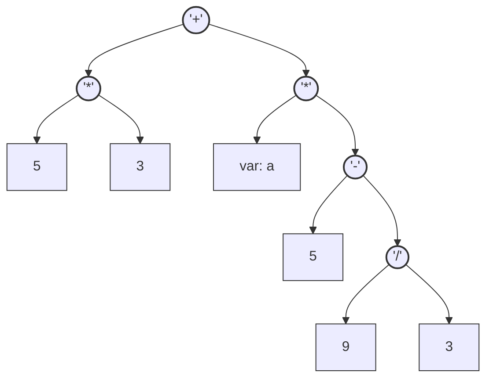
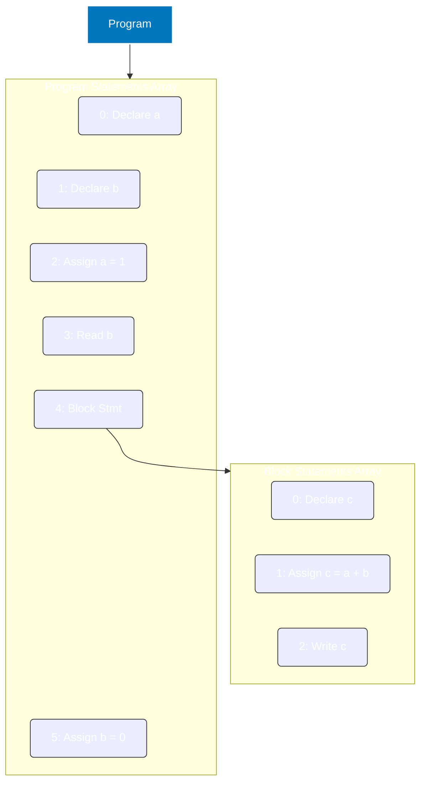

# Calc Plus

[ANTLR4 Getting Started](https://github.com/antlr/antlr4/blob/master/doc/getting-started.md)의 Expr 예제를 기반으로 조금씩 확장한 언어다.

일반 프로그래밍 언어 개발을 바로 시작할 경우 상당히 많은 문법적 특성도 고려해야 하고, ANTLR 기반의 전단부 해석을 학습하기에 복잡한 부분이 많다.

이에 따라, 계산기 수준의 표현력인 최소한의 언어부터 시작해서, 변수 도입, 입출력까지만 지원하는 언어를 만들려 한다.

## [Calc-0](https://github.com/2025-Compiler-Study/calc-plus-ref/tree/calc0)

언어 스펙은 예제의 Expr 문법에서 조금 확장한 아래 문법을 참고한다.

1. 코드는 단일 수식으로 끝난다.
2. 하지만 한 수식에는 여러 항의 연산이 가능하다.
3. 사칙연산에 대한 우선순위는 적용된다.
4. 괄호는 연산 우선순위를 강제하기 위해 사용된다.

```antlrv4
grammar CalcPlus;
calc0   :   expr EOF ;
expr    :   expr ('*'|'/') expr # MulDiv
        |   expr ('+'|'-') expr # AddSub
        |   INT                 # Int
        |   '(' expr ')'        # Parens
        ;
WS  : [ \t\r\n]+ -> skip;
INT : [0-9]+ ;
```

* L1의 문법 제목을 `Expr` 대신 `CalcPlus`로 변경
* L2의 프로그램 전체 문법을 `prog` 대신 `calc0`로 변경
* L3~L6 마지막에 `#`으로 시작하는 부분의 Label이 추가
* L8이 원래 `NEWLINE : [\r\n]+ -> skip;`이었음
* L8을 `WS`로 변경하여, 스페이스와 탭도 무시할 수 있게 변경

### 구현 과제 #1

1. ANTLR CLI를 사용하여 lexer, parser 코드를 생성한다.
2. parser 생성 시 visitor, listener 패턴을 모두 지원할 수 있게 생성한다.
3. parser의 visitor, listener를 확장/구현한 구조체/클래스에서 계산을 수행한다.
4. parser의 결과물을 계산 결과로 반환한다.
5. 예시 입력으로 `10 + 2 * (5 - 9 / 3)`가 입력된다면 `14`를 계산해 내야 한다.

힌트: visitor 방식이 직관적임. 하지만 listener로도 구현해 보길 바람.

### 구현 과제 #2

1. ANTLR CLI를 사용하여 lexer, parser 코드를 생성한다.
2. parser 생성 시 visitor, listener 패턴을 모두 지원할 수 있게 생성한다.
3. 현재 문법은 InFix 순서로 수식이 작성되어있는데, 이를 PostFix 순서로 변경해서 출력한다.
4. 예시 입력으로 `10 + 2 * (5 - 9 / 3)`가 입력된다면 `10 2 5 9 3 / - * +`가 출력되어야 한다.

힌트: listener 방식이 직관적임. 하지만 visitor로도 구현해 보길 바람.

### 알아 둘 내용

1. `expr` 규칙에 `|`로 여럿 표시한 것은, `expr`이 여러 방식으로 해석될 수 있다는 뜻이다.
2. `expr`이 재귀적으로 쓰인 것은, 좌항/우항을 재귀적으로 활용할 수 있다는 뜻이다.
3. `expr` 규칙은 위에서부터 아래로 우선순위를 가진다. (현재 사칙연산 우선순위를 구현 중)
4. 괄호 규칙은 맨 아래 있지만, 괄호로 시작하는 규칙이 유일하므로, 의도대로 최우선 처리된다.
5. L3~L6 마지막에 `#`을 추가한 것은 각 규칙의 해석을 추가해준다. (라벨 추가 시 어떤 메서드가 생성되는지 확인해 볼 것)
6. 실제 코드 작업 과정에서 연산자를 가져오는 방법, 좀 더 쉽게 가져올 방법을 생각해볼 것. (ANTLR 문법 수정 필요)

## [Calc-1](https://github.com/2025-Compiler-Study/calc-plus-ref/tree/calc1)

언어 스펙은 단순한 상수 계산만 가능하던 Calc-0에서 변수 개념을 확장해보자.

1. 변수 개념을 도입한다.
2. 변수는 알파벳으로만 구성한 단어이며, 대소문자를 구분한다.
3. 코드는 변수에 수식 계산 값을 저장하는 문장 여러개로 구성된다. (최소 한 문장, 최대 제한 없음)
4. 변수 값 저장은 C언어와 같이 `변수 = 수식;` 방식으로 값을 변수에 저장한다.
5. 수식은 괄호, 사칙연산이 포함된 Calc-0에 숫자 대신 변수가 들어갈 수 있게 확장한다.
6. `;`으로 각 문장의 종료를 구분한다.

```antlrv4
grammar CalcPlus;
calc0   :   expr EOF ;
expr    :   expr ('*'|'/') expr # MulDiv
        |   expr ('+'|'-') expr # AddSub
        |   INT                 # Int
        |   VAR                 # Var
        |   '(' expr ')'        # Parens
        ;

calc1   :   (stmt)+ EOF;
stmt    :   VAR '=' expr ';'    # ExprAssign
        ;

WS  : [ \t\r\n]+ -> skip;
INT : [0-9]+ ;
VAR : [A-Za-z]+ ;
```

* L6에 `expr`이 `VAR`를 사용할 수 있게 추가
* L10에 Calc-1 프로그램의 문법을 선언
* L11에 변수에 값을 선언하는 문장을 정의
* L16에 변수가 될 수 있는 규칙을 선언

### 구현 과제 #1

1. 각 변수에 값을 계산하여 저장할 수 있게 구현해야 한다.
2. 변수에 값이 저장된 다음 문장부터는 해당 변수를 계산 결과로 해석한다.
3. 수식에 포함된 변수가 처음 선언된 변수인 경우 `0`으로 취급하여 계산한다.
4. 수식 계산중에는 변수의 값이 바뀌지 않는다. 수식의 결과로 변수 값을 저장할 때만 변경된다.
5. 변수에 값을 다시 저장한다면 최근 값으로 덮어쓴다. (변수는 모두 mutable하다.)
6. 프로그램이 끝날 때 까지 선언된 변수 이름과 마지막 값들을 알아낼 수 있어야 한다.

아래는 Calc-1 프로그램 예제와, 각 문장마다 값이 변경되는 예시를 보여준다.  
(문법에는 주석을 지원하지 않지만 해석 편의를 위해 작성한 것이다.)

```
a = 1;          // a == 1
b = a + 2;      // a == 1, b == 3
c = b * 3;      // a == 1, b == 3, c == 9
a = a + 1;      // a == 2, b == 3, c == 9
d = (5 - e) * 2;// a == 2, b == 3, c == 9, d == 10, e == 0
```

문장의 구분은 `;`를 기준으로 하므로, 위 코드와 아래 한 줄 코드는 동일한 코드다.

```
a=1;b=a+2;c=b*3;a=a+1;d=(5-e)*2;
```

힌트: visitor 방식으로 구현을 추천함.

### 구현 과제 #2

1. 프로그램을 계산하진 않아도 된다.
2. 변수에 값이 저장될 때와, 변수가 수식에 사용될 때를 감지한다.
3. 변수가 저장되기 전에 수식에서 사용되는지 확인하여 경고를 출력한다.
4. 경고에는 해당 변수의 위치를 알기 위한 Line, Column 정보도 포함되어야 한다.

아래 예제의 주석처럼 출력하진 않아도 되지만, 주요 내용은 알 수 있어야 한다.

```
a = b + 3; // Line 1 Column 4 : Variable 'b' is not defined.
```

당연히 아래와 같이 같은 변수가 할당과 수식에 사용되어도 할당 전에 접근하면 오류다.

```
a = a + 1; // Line 1 Column 4 : Variable 'a' is not defined.
```

힌트: listener 방식으로 구현을 추천함.

### 알아 둘 내용

1. 프로그램의 시작 지점이 `Calc1`으로 변경되었음.  
   (보통 기존 룰을 변경하지만, 기존 코드 참고 및 하위호환성을 위해 일부러 구분하는 중)
2. `calc1`은 `stmt`가 여러번 반복되므로, visitor의 경우 반복 처리가 필요하다.
3. 값을 할당하는 부분은 값을 반환하지 않는다. visitor의 경우 반환 값 검증 시 구분이 필요하다.

## [Calc-2](https://github.com/2025-Compiler-Study/calc-plus-ref/tree/calc2)

언어 스펙은 코드의 흐름을 제어할 수 있는 분기문을 추가해보자.

1. 분기문 개념을 도입한다.
2. 분기 조건은 수식과 수식 간의 값이 비교 수식에 일치하는지 기준으로 판단한다.
3. 분기문 문법은 C언어와 동일한 방식으로 `if (cond) {cond_true} else {cond_false}` 방식이다.
4. `if` 조건이 일치하지 않는 `else` 부분은 생략할 수 있다.
5. 분기문의 문맥 구분을 위해 조건부의 `()`도 필수이고, 처리부의 `{}`도 필수다.
6. 조건부의 비교 연산은 `==`, `!=`, `<`, `>`, `<=`, `>=`이 가능하다.
7. 논리 수식간의 연산자는 아직 지원하지 않는다. (`&&`, `||` 없음)

```antlrv4
grammar CalcPlus;
calc0   :   expr EOF ;
expr    :   expr ('*'|'/') expr # MulDiv
        |   expr ('+'|'-') expr # AddSub
        |   INT                 # Int
        |   VAR                 # Var
        |   '(' expr ')'        # Parens
        ;

calc1   :   (stmt)+ EOF;
stmt    :   VAR '=' expr ';'                    # ExprAssign
        |   'if' '(' cond ')' thenBlock=block
            ('else' elseBlock=block)?           # IfElse
        ;

calc2   :   (stmt)+ EOF;
cond    :   expr ('=='|'!='|'>'|'>='|'<'|'<=') expr ;
block   :   '{' (stmt)* '}' ;

WS  : [ \t\r\n]+ -> skip;
INT : [0-9]+ ;
VAR : [A-Za-z]+ ;
```

* L12,13에 stmt가 가능한 예시로 if-else 문법을 추가
* L16에 Calc2 프로그램의 문법을 선언
* L17에 조건문 표기법으로 크기비교 연산들을 정의
* L18에 if-else에 들어갈 블록을 선언

### 구현 과제 #1

1. 각 변수에 값을 계산하여 저장할 수 있게 구현해야 한다.
2. 변수에 값이 저장된 다음 문장부터는 해당 변수를 계산 결과로 해석한다.
3. 수식에 포함된 변수가 처음 선언된 변수인 경우 `0`으로 취급하여 계산한다.
4. 수식 계산중에는 변수의 값이 바뀌지 않는다. 수식의 결과로 변수 값을 저장할 때만 변경된다.
5. 변수에 값을 다시 저장한다면 최근 값으로 덮어쓴다. (변수는 모두 mutable하다.)
6. 분기문을 구현하여 조건에 따라 if-else(생략 가능) 부분만 실행한다.
7. 분기문 블록에 대한 변수 scope 개념은 도입하지 않아도 된다.
8. 프로그램이 끝날 때 까지 선언된 변수 이름과 마지막 값들을 알아낼 수 있어야 한다.

아래는 Calc-2 프로그램 예제와, 각 문장마다 값이 변경되는 예시를 보여준다.  
(문법에는 주석을 지원하지 않지만 해석 편의를 위해 작성한 것이다.)

```
a = 1;          // a == 1
if (a >= 1) {   // true, executing block
    b = a + 2;  // a == 1, b == 3
    c = b * 3;  // a == 1, b == 3, c == 9
} else {        // false, skipping block
    b = a;
    c = b;
}
a = a + 1;      // a == 2, b == 3, c == 9
d = (5 - e) * 2;// a == 2, b == 3, c == 9, d == 10, e == 0
```

힌트: 알아서 결정해보자

## [Calc-3](https://github.com/2025-Compiler-Study/calc-plus-ref/tree/calc3)

변수의 값 입력과 출력을 도입해보자.

1. 내장 함수 개념을 도입한다. `read`, `write` 함수가 추가된다.
2. 함수 호출은 C언어를 비롯한 대부분의 프로그래밍 언어 처럼 `read()`방식으로 처리된다.
3. `a = read()` 방식으로 `read`는 인자가 없고, 입력받은 숫자를 반환한다.
4. `read()`는 즉시 변수로 값을 저장해야 하며, 수식의 일부가 될 수 없다. (읽기 순서 모호성 방지)
5. `write(b)`, `write(1+2)` 방식으로 `write`는 인자로 수식을 입력받고, 결과는 반환하지 않는다.

```antlrv4
grammar CalcPlus;
calc0   :   expr EOF ;
expr    :   expr ('*'|'/') expr # MulDiv
        |   expr ('+'|'-') expr # AddSub
        |   INT                 # Int
        |   VAR                 # Var
        |   '(' expr ')'        # Parens
        ;

calc1   :   (stmt)+ EOF;
stmt    :   VAR '=' expr ';'                    # ExprAssign
        |   VAR '=' 'read' '(' ')' ';'          # ReadAssign
        |   'if' '(' cond ')' thenBlock=block
            ('else' elseBlock=block)?           # IfElse
        |   'write' '(' expr ')' ';'            # Write
        ;

calc2   :   (stmt)+ EOF;
cond    :   expr ('=='|'!='|'>'|'>='|'<'|'<=') expr ;
block   :   '{' (stmt)* '}' ;

calc3   :   (stmt)+ EOF;

WS  : [ \t\r\n]+ -> skip;
INT : [0-9]+ ;
VAR : [A-Za-z]+ ;
```
* L12에 `read()`를 할 수 있는 문법을 추가 (수식의 일부가 되는걸 막기 위해 변수에 저장)
* L14에 `write()`를 할 수 있는 문법을 추가 (문장 중 하나로 함수 호출만 지원, 값은 수식이 될 수 있음)
* L22에 Calc3 프로그램의 문법을 선언 (Calc1, Calc2와 동일)

### 구현 과제 #1

1. Hello world처럼 지정된 값을 출력하는 프로그램을 실행할 수 있게 한다.
2. Echo처럼 변수를 입력 받고 즉시 다시 출력하는 프로그램을 실행할 수 있게 한다.
3. Calc-3를 지원하는 인터프리터가 CLI 실행 파일/script 파일로 생성되어야 한다.
4. `$ calc3 test.cp`처럼 인터프리터 실행의 인자로 Calc3 소스 경로를 입력받는다.
5. 이후 `read()`에 의한 사용자의 입력은 stdin으로 입력받는다.
6. `write()`에 의한 프로그램의 출력은 stdout으로 출력한다.
7. `read()`가 실패하는 경우 0으로 취급 혹은 여러 형태로 프로그램을 강제 종료한다. (stdin의 입력이 더 없거나, 유효한 숫자가 아님)

고려사항

* 각 언어의 test framework를 최대한 활용하고, CLI는 단순한 연결 위주로 개발한다.
* 각 테스트의 입력은 코드와 사용자 입력 값이며, 결과는 프로그램의 출력과 비교한다.
* 이번 과제는 문법과 시맨틱의 난이도보다 IO 연동 처리에 집중하는 과제다.

### 구현 과제 #2

구현과제 1번은 Hello world 부터 Echo까지 입출력에만 집중했다.
이제 기존 Calc-2까지 구현했던 수식 연산, 변수 읽기/쓰기, 분기문 까지 연동한다.

## [Calc-4](https://github.com/2025-Compiler-Study/calc-plus-ref/tree/calc4)

이제는 변수 스코프 개념을 도입해 볼 것이다.  
지정된 범위 안에서만 변수를 사용하고, 특정 영역에 변수를 재정의하는 섀도잉을 구현해 볼 것이다.

1. `{}`로 감싼 코드 블록을 임의로 추가할 수 있다. (이제 if-else에 제약받지 않음)
2. `{ {} }` 같이 블록을 중첩하여 사용할 수 있다. (다중 if-else문과 동일)
3. 변수를 사용하기 전에 선언을 해야 한다.
4. 블록 내 선언한 변수는 그 블록에서만 쓸 수 있다. (블록을 나가면 유효하지 않음)
5. 변수가 선언된 블록 안에 중첩된 내부 블록들은 밖에서 선언된 변수를 쓸 수 있다.
6. 밖에서 선언된 변수를 내부 블록에서 재정의 할 수 있다.
7. 내부에서 재정의된 변수는 개별적인 스코프를 가지며, 해당 스코프가 끝나면 재정의 이전의 값을 쓸 수 있다.

```antlrv4
grammar CalcPlus;
calc0   :   expr EOF ;
expr    :   expr ('*'|'/') expr # MulDiv
        |   expr ('+'|'-') expr # AddSub
        |   INT                 # Int
        |   VAR                 # Var
        |   '(' expr ')'        # Parens
        ;

calc1   :   (stmt)+ EOF;
stmt    :   VAR '=' expr ';'                    # ExprAssign
        |   VAR '=' 'read' '(' ')' ';'          # ReadAssign
        |   'if' '(' cond ')' thenBlock=block
            ('else' elseBlock=block)?           # IfElse
        |   'write' '(' expr ')' ';'            # Write
        |   'int' VAR (',' VAR)* ';'            # Declare
        |   block                               # StmtBlock
        ;

calc2   :   (stmt)+ EOF;
cond    :   expr ('=='|'!='|'>'|'>='|'<'|'<=') expr ;
block   :   '{' (stmt)* '}' ;

calc3   :   (stmt)+ EOF;

calc4   :   (stmt)+ EOF;

WS  : [ \t\r\n]+ -> skip;
INT : [0-9]+ ;
VAR : [A-Za-z]+ ;
```

* L17에 int 타입 변수 선언문이 추가된다. 한 번에 여러 변수를 선언할 수 있으나, 선언만 할 수 있고 동시에 값 초기화는 되지 않는다.
* L18에 일반 문장으로 block이 들어갈 수 있게 된다. block은 if-else에 쓰던것과 같다.

### 구현 과제 #1

1. 아직 블록은 구현하지 않고, 선언문 문법만 구현한다. (조건문도 일단 제외한다.)
2. 변수는 선언되어야 읽거나 쓸 수 있다.
3. 선언되지 않은 변수 읽기/쓰기는 에러를 출력하고 인터프리터 실행을 종료한다.
4. 변수는 선언되었을 때 0으로 값이 초기화된다. (선언 이후 즉시 읽기 가능)
5. 한 스코프 내의 변수 재정의는 에러를 출력하고 인터프리터 실행을 종료한다.

힌트: 변수를 저장할 심볼 테이블에 `등록`, `조회`, `변경`을 일으키는 지점을 생각해보자.

### 구현 과제 #2

1. 구현과제 1의 연장이다. 이제 블록이 추가된다.
2. 변수가 선언된 블록과 내부 중첩 블록들에서는 읽고 쓸 수 있다.
3. 변수가 선언된 블록이 끝나면 더 이상 쓸수 없다. (선언되지 않은 변수 취급)
4. 이미 선언된 변수를 내부 중첩 블록에서 재정의 할 수 있다. (변수 섀도잉)
5. 변수가 섀도잉되면 그 밖에서 선언되었던 원래 변수의 값을 읽거나 쓰지 못한다.
6. 섀도잉 된 변수가 종료되면 섀도잉 이전의 값으로 읽고 쓸수 있어야 한다.

힌트1: 심볼 테이블에 `등록`, `조회`, `변경` 뿐만 아니라 `삭제` 도 되어야 한다.  
힌트2: 블록 안에 블록을 사용하는 다중 중첩은 마치 스택을 push, pop하는 것 같다.

## [Calc-5](https://github.com/2025-Compiler-Study/calc-plus-ref/tree/calc5)

이번에는 언어 스펙은 건드리지 않는다.  
이제 Parse Tree 순회 시 즉시 실행이 아닌 AST를 구성하고 실행하게 한다.

```antlrv4
grammar CalcPlus;

program :   (stmt)+ EOF;

stmt    :   'int' VAR (',' VAR)* ';'            # Declare
        |   VAR '=' expr ';'                    # ExprAssign
        |   VAR '=' 'read' '(' ')' ';'          # ReadAssign
        |   'write' '(' expr ')' ';'            # Write
        |   'if' '(' cond ')' thenBlock=block
            ('else' elseBlock=block)?           # IfElse
        |   block                               # StmtBlock
        ;

expr    :   expr ('*'|'/') expr # MulDiv
        |   expr ('+'|'-') expr # AddSub
        |   INT                 # Int
        |   VAR                 # Var
        |   '(' expr ')'        # Parens
        ;

cond    :   expr ('=='|'!='|'>'|'>='|'<'|'<=') expr ;
block   :   '{' (stmt)* '}' ;

WS  : [ \t\r\n]+ -> skip;
INT : [0-9]+ ;
VAR : [A-Za-z]+ ;
```

* 이제부터 프로그래밍 언어의 진입 문법은 `program`으로 통일한다.
* 아래 구현 과제를 직관적으로 볼 수 있도록 일부 순서를 정리했다.
* 기존 `calc0`부터 `calc4`까지는 반복으로 사실상 무의미하므로 정리한다.
* 기존 구현 및 테스트 코드는 삭제해도 된다. (문법에 맞춰 유지해보는 것도 좋음)

### 구현 과제 #1

1. AST의 구성 요소를 생각하고 구현해야 한다.
2. ANTLR로 작성한 문법에서 의미를 가지는 시맨틱한 부분이 AST의 노드가 된다.
3. Parse Tree에서 AST로 변환 시 보통 구성 요소가 줄어들지만, 늘어날 수도 있다.
4. 이전 과제의 테스트용 작성 코드를 AST로 구성하면 어떻게 될 지 직접 구성해본다.

힌트: 프로그램 진입 지점(`program`)부터 노드를 구성해보고, 의미에 따라 병합/분리한다.

고려사항: `expr` 계산을 단순화 하기 위한 방법으로 후위표기법 등을 고려할 수도 있으나, 가독성이나 구현 개념 일치를 위해 일반 트리로 그리는 것을 추천한다.

#### 예제 #1

```
5 * 3 + a * (5 - 9 / 3)
```

위와 같은 수식을 AST로 구성하는 예시 중 하나는 아래와 같다. (동일할 필요는 없다.)



1. 괄호가 존재하지 않는다.
2. "곱하기, 나누기" 와 "더하기, 빼기"를 구분하지 않고 표현한다.
3. 연산자의 왼쪽과 오른쪽 값에는 연산, int, var이 들어갈 수 있다.

AST 트리를 구성하는 과정에서 우선순위 여부가 트리 자체에 녹아있다.  
트리의 자식 -> 부모 순으로 연산이 우선 처리되어야 한다.  
left, right 자리에 연산, int, var를 모두 넣을 수 있어야 한다. (인터페이스 형변환)

#### 예제 #2

```
int a, b;
a = 1;
b = read();
{
  int c;
  c = a + b;
  write(c);
}
b = 0;
```

위와 같은 코드를 AST로 구성하는 예시 중 하나는 아래와 같다. (동일할 필요는 없다.)



1. Program 안에 각 statement에 해당하는 값은 배열로 취급된다.
2. 문법 상으로는 한 문장에서 2개 변수를 선언했지만, AST에서는 각각 선언한다.

AST가 Abstract Syntax Tree지만 꼭 Binary Tree로 구성될 필요는 없다.  
다만 각 노드가 배열로 표현될 때, 그 순서는 중요하다.

#### 힌트

* 문법의 제약사항을 너무 과도하게 구현하려 할 필요 없다.  
  AST는 코드의 의미에 대한 핵심을 담은 것일 뿐이며, 기존 파스 트리를 재해석한 내용이다.  
  문법의 제약사항은 파스 트리가 나타내며, AST로 변환할 때 의미가 맞는지 다시 판단해도 된다.  
  표현하는 대상이나 의미가 비슷하다면 기존 파스 트리/문법 요소를 통합/분리해도 된다.
* ANTLR로 작성한 문법을 보면, 프로그램은 여러 개의 문장(statement)으로 구성되어 있다.  
  즉, 현재 문법에서 AST의 최상위 노드는 문장을 여러 개 들고 있을 수 있어야 한다.
* 문장의 종류는 선언(declare), 할당(assign), 읽기(read), 쓰기(write), 조건문(if-else), 코드블록(block)이 있다.
* 할당(assign)의 경우, 오른쪽의 표현(expression)이 계산 완료되어야 할당을 할 수 있다.  
  즉, 할당 노드의 자식은 왼쪽에 변수, 오른쪽에 표현이 들어갈 수 있다.
* 읽기에 대한 의미를 생각해보면 입력을 받은 값을 반환했을때 변수에 값을 할당하는 방식이다.  
  즉, read 함수 호출이 표현(expression)의 일종이라고 생각할 수 있다.  
  좀 더 생각해보면 할당과 읽기가 하나의 문장 종류로 취급 될 수 있다.
* 쓰기의 경우 함수는 호출했지만, 값을 어딘가에 반환하지 않았다.  
  앞에서 read 함수 호출을 표현(expression)으로 취급했듯, write함수도 호출로 취급한다면  
  아래와 같이 생각해보고, 문장의 종류를 통합할 수도, 개별적으로 늘릴 수도 있다.
  1) 변수에 할당하지 않는, 표현 그 자체도 문장이 될 수 있어야 한다.
  2) 쓰기와 같이 표현의 값을 변수에 할당하지 않고 버리는 경우로 생각할 수도 있다.
* 문법 정의에서 조건문의 비교(cond)는 수식(expr)의 사칙연산과 완전히 다른 것으로 취급한다.  
  하지만 가운데 연산자를 두고 왼쪽 오른쪽 값을 비교하는 것은 사칙연산 표현과 비슷한 구조다.  
  부울 변수를 정수형으로 취급해서 true인 것을 1로 반환하고, false인 것을 0으로만 반환한다면  
  굳이 별도의 노드로 취급되지 않아도 된다.
* 함수 호출은 나중에 수정하게 될 가능성이 높다.  
  함수 호출에 대한 표현을 일반화 할 자신이 없다면  
  일단 수식으로 취급되면서, 수식을 입력받을 수 있는 노드로 생각하자.

### 구현 과제 #2

1. 이전 구현한 AST를 시각화하여 출력하는 기능을 추가한다.
2. 출력 방식은 본인이 편한 방법을 사용하면 된다.
3. 이 과제의 목적은 Parse Tree의 분석 결과가 일치하는지 쉽게 확인하기 위해서다.

힌트: 트리 구조를 출력하려면 트리 내 노드의 출력을 Visitor처럼 출력해줘야 한다.

아래 코드를 AST로 표현하고 출력하는 여러 방식을 참고하여 본인이 이해하기 쉽게 작성한다.

```
5 * 3 + a * (5 - 9 / 3)
```

LISP 방식은 전위 표기법과 비슷하다. (트리 깊이 관계 표현을 위해 괄호를 사용한다.)

```lisp
(+ (* 5 3) (* a (- 5 (/ 9 3))))
```

JSON 방식으로 표기해도 된다. (각 언어의 JSON marshaller, pretty print를 활용 가능)  

```json
{
  "type": "expr",
  "left": {
    "left": { "type": "int", "value": 5 },
    "op": "*",
    "right": { "type": "int", "value": 3 }
  },
  "op": "+",
  "right": {
    "type": "expr",
    "left": { "type": "var", "value": "a" },
    "op": "*",
    "right": {
      "type": "expr",
      "left": { "type": "int", "value": 5 },
      "op": "-",
      "right": {
        "type": "expr",
        "left": { "type": "int", "value": 9 },
        "op": "/",
        "right": { "type": "int", "value": 3 }
      }
    }
  }
}
```

혹은 Python이 들여쓰기 하듯이 출력하는 것도 방법이다.

```text
Left:
    Left:
        Value: 5
    Op: *
    Right:
        Value: 3
Op: +
Right:
    Left:
        Variable: a
    Op: *
    Right:
        Left:
            Value: 5
        Op: -
        Right:
            Left:
                Value: 9
            Op: /
            Right:
                Value: 3
```

출력 방식과 각 방식에서 표현되어야 하는 필드는 본인이 선택하면 된다.

### 구현 과제 #3

1. 앞의 AST로 구성된 코드를 실행해주는 Executor를 구현한다.
2. 변수 관리는 이전 Calc4에서 구현한 Symbol Table을 활용한다.
3. Parse tree 해석 및 순회 없이, 임의로 만든 AST만 실행하면 된다.
4. 만약 문맥상 문제가 있다면, 즉시 종료한다. (변수 재선언, 미선언 사용 등)

힌트: 기존 ANTLR가 생성한 Visitor를 참고해도 되고, AST 기반이라 더 단순해도 된다.

굳이 다시 AST로 구현하는 이유는 그 다음 Calc6에서 드러날 것이다.

### 구현 과제 #4

1. ANTLR로 만든 Parse tree를 순회하면서 AST를 구성하는 Builder를 구현한다.
2. Parse tree 순회 중 오류 발생 시 그 오류를 기록한다. (변수 재선언, 미선언 사용 등)
3. Parse tree를 전체 순회하고 나서 오류가 있다면 오류를 출력한다.
4. 오류가 없다면 과제 3의 Executor에 AST를 실행시킨다.

힌트: Executor도 Symbol Table이 필요하지만, Builder도 Symbol Table이 필요하다.